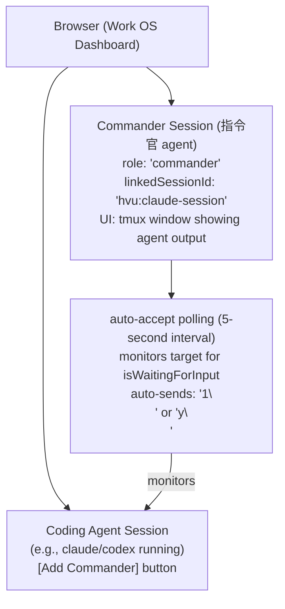

# Commander Agent Integration - Implementation Guide

## Status: ✅ Complete (Commit: 2aae89a)

This document describes the implementation of the Commander Agent feature that enables automatic response to user prompts in target sessions.

## Architecture Overview



## Implementation Details

### Phase 1: Session Metadata Store

**File: `src/lib/session-store.ts`**

Singleton that manages commander/target relationships:

```typescript
export class SessionStore {
  linkCommander(commanderSessionId, targetSessionId)  // Link pair
  unlinkCommander(commanderSessionId)                 // Unlink pair
  getMetadata(sessionId)                              // Get role & link
  setMetadata(sessionId, metadata)                    // Set metadata
  getAllLinks()                                       // Get all pairs
}
```

**Metadata structure:**
```typescript
interface SessionMetadata {
  role?: 'commander' | 'target' | 'regular';
  linkedSessionId?: string;
}
```

### Phase 2: Auto-Accept Manager

**File: `src/lib/auto-accept.ts`**

Polls target sessions and auto-responds to prompts:

```typescript
export class AutoAcceptManager {
  start(commanderSessionId, targetSessionId, pool)    // Begin polling
  stop(commanderSessionId)                            // Stop polling
  isActive(commanderSessionId)                        // Check status
  getActive()                                         // Get all active
}
```

**Detection logic:**
- Pattern: `[Yy]/[Nn]` → responds with `y\n`
- Pattern: `1.\s+allow|1.\s+yes|●\s*1\.` → responds with `1\n`
- Shell prompt: `^\s*[$#>]\s*$` → ready for input
- Question mark: `\?$` → prompt

### Phase 3: REST API Endpoint

**File: `src/app/api/sessions/[id]/auto-accept/route.ts`**

Manage auto-accept for a session:

```typescript
POST /api/sessions/{commanderSessionId}/auto-accept
  Request: { enabled: boolean, targetSessionId?: string }
  Response: { message, commanderSessionId, targetSessionId }

GET /api/sessions/{commanderSessionId}/auto-accept
  Response: { enabled, targetSessionId, role }
```

### Phase 4: Sessions API Extension

**File: `src/app/api/sessions/route.ts`**

Extended to support session linking:

```typescript
POST /api/sessions
  Request: {
    name, command, cwd, templateName,
    sessionRole?: 'commander' | 'target',
    linkedSessionId?: string
  }

GET /api/sessions
  Response includes:
  - sessionRole: 'commander' | 'target' | 'regular'
  - linkedSessionId: string (if linked)
```

### Phase 5: UI Components

**File: `src/app/page.tsx`**

**Added state:**
```typescript
const [commanderModal, setCommanderModal] = useState<{ targetSessionId: string } | null>(null);
const [autoAcceptStatus, setAutoAcceptStatus] = useState<Record<string, boolean>>({});
```

**New button in session footer:**
```
[⚔️ Add Commander] - Opens modal to create commander session
```

**Commander Modal:**
- Input: Commander session name
- Select: Template (filters for 'commander' templates)
- Action: Start commander with auto-accept enabled

**Session Badges:**
- Commander badge: `⚔️ Commander`
- Watched badge: `🎯 Watched by: {session-name}`

## Usage

### Creating a Commander Session

1. Open Work OS Dashboard
2. Find a coding agent session (e.g., `hvu:claude`)
3. Click `[⚔️ Add Commander]` button
4. Enter commander name (e.g., `commander-claude`)
5. Select template (optional)
6. Click `Launch`

### What Happens

1. New tmux session created: `commander-claude`
2. Sessions linked: `commander-claude` → `hvu:claude`
3. Auto-accept enabled on `commander-claude`
4. AutoAcceptManager starts 5-second polling
5. When `hvu:claude` prompts for input, `commander-claude` auto-responds

### Manual Control

In the commander session, user can:
- Type custom instructions directly
- Override auto-accept by typing live input (resets 30-second interrupt timer)
- View target session output via monitoring

## Integration with Server

The global `autoAcceptManager` singleton is:
- Created on module load
- Accessed via API endpoints
- Uses the `sessionPool` to resolve sessions
- Timers cleaned up when sessions are killed

## Testing

### Manual Test Steps

```bash
# 1. Start a coding session
tmux new-session -d -s test-claude "sleep infinity"

# 2. Open Work OS: http://localhost:4311
# 3. See test-claude in session list

# 4. Click [⚔️ Add Commander]
#    - Name: test-commander
#    - Template: (leave blank)
#    - Click Launch

# 5. Verify in terminal:
tmux list-sessions  # Should see test-commander

# 6. Test auto-accept by sending a prompt
tmux send-keys -t test-claude "echo -n 'Continue? (y/n) '" Enter
# Auto-accept should respond with 'y' in 5 seconds

# 7. Check auto-accept logs in server console
# [auto-accept] Started monitoring test-commander → local:test-claude
# [auto-accept] Detected prompt in local:test-claude, sending: y\n
```

### API Test

```bash
# Start commander
curl -X POST http://localhost:4311/api/sessions \
  -H "Content-Type: application/json" \
  -d '{
    "name": "test-cmd",
    "command": "bash",
    "cwd": "/tmp",
    "sessionRole": "commander",
    "linkedSessionId": "local:test-target"
  }'

# Enable auto-accept
curl -X POST http://localhost:4311/api/sessions/local:test-cmd/auto-accept \
  -H "Content-Type: application/json" \
  -d '{
    "enabled": true,
    "targetSessionId": "local:test-target"
  }'

# Check status
curl http://localhost:4311/api/sessions/local:test-cmd/auto-accept
```

## Known Limitations

1. **Template Requirements**: Auto-accept works for any session; templates are optional UI enhancement
2. **Prompt Detection**: Heuristic-based; may not detect all prompt types
3. **Single Target**: One commander can monitor one target (extendable to many)
4. **No Persistence**: Links lost on server restart
5. **Basic Logic**: Smart key selection limited to 'y'/'1' patterns

## Future Enhancements

1. **Multi-Target**: One commander monitors multiple targets
2. **Conditional Logic**: If-then rules for different prompts
3. **Command Injection**: Commander can inject commands into target
4. **Persistence**: Save links to database
5. **UI Improvements**: Live auto-accept toggle in session card
6. **Advanced Patterns**: Support for more complex prompts

## Files Changed

```
✅ Created:
  src/lib/session-store.ts                     (60 lines)
  src/lib/auto-accept.ts                       (140 lines)
  src/app/api/sessions/[id]/auto-accept/route.ts (80 lines)

✅ Modified:
  src/app/api/sessions/route.ts               (+30 lines)
  src/app/page.tsx                            (+200 lines)

✅ Commit:
  2aae89a - feat: implement Commander Agent integration
```

## References

- Session pool: `src/lib/tmux-provider.ts`
- UI component: `src/app/page.tsx` (lines 211-215, 481-543, 831-922, 987-1082)
- Original plan: `#司令官Agent統合` (project_takt_integration.md)
