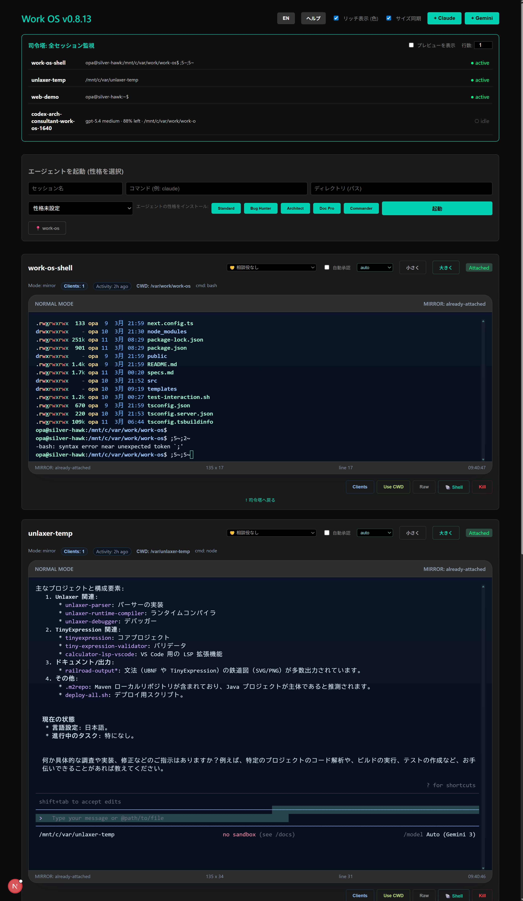

# Work OS
[日本語](#work-os-日本語) | [English](#work-os-english)

## Work OS English

Work OS is a browser-based tmux operations console for running and supervising local agent sessions. It is designed for a host machine where `tmux`, `codex`, `claude`, `gemini`, shells, and project directories already exist, and exposes those sessions through a web UI.

### Interface Snapshot



### What It Does

- Monitors multiple tmux sessions from one dashboard
- Opens live web terminals for shell-oriented sessions
- Mirrors agent/TUI sessions safely when direct attach is unstable
- Lists tmux clients and lets you detach or kill them
- Launches new agent sessions with a chosen command, working directory, and template
- Opens child shell sessions in the same working directory

### How To Use

#### Local Development

```bash
cd /mnt/c/var/work/work-os
npm install
PORT=4311 npm run dev
```

Open `http://127.0.0.1:4311`.

#### Docker

```bash
cd /mnt/c/var/work/work-os
docker compose up -d --build
```

Open `http://127.0.0.1:3000`.

The Docker container mounts:

- `/usr/local/bin/tmux:/usr/local/bin/tmux:ro`
- `/mnt/c/var/work/work-os/src:/app/src`
- `/mnt/c/var/work/work-os/public:/app/public`
- `/mnt/c/var/work/work-os/templates:/app/templates`
- `/tmp/tmux-1000:/tmp/tmux-1000`
- `/mnt/c/var:/mnt/c/var`

This is the critical point: the container does not run an isolated tmux server. It connects to the host tmux socket, so browser sessions can inspect and interact with the host machine's tmux sessions.

### tmux Model

Work OS works against the host tmux server.

- Agent sessions such as `codex`, `claude`, and `gemini` are often safer in `mirror` mode
- Shell sessions are usually best in `attach` or `resize-client` mode
- Child shell sessions are created as separate tmux sessions with the same working directory
- `Clients` shows `tmux list-clients` output for a selected session

Important modes:

- `auto`: Work OS chooses between attach and mirror
- `mirror`: capture-pane based view, safer for complex TUIs
- `readonly-mirror`: same as mirror, but input disabled
- `attach`: live PTY attach to tmux
- `resize-client`: live attach plus client-size synchronization

### Technical Details

Architecture:

- Frontend: Next.js App Router + React
- Backend: custom Node/Express server in `src/server.ts`
- Transport: Socket.IO
- Terminal emulator: xterm.js + fit addon
- PTY bridge: `node-pty`
- Multiplexer: host `tmux`

Session flow:

1. The dashboard loads session metadata from `src/app/api/sessions/route.ts`.
2. Terminal connections go through `src/server.ts`.
3. Depending on mode, Work OS either:
   - attaches a PTY to tmux, or
   - mirrors screen content with tmux capture output.
4. Session actions such as `send-key`, `kill`, `shell`, and `clients` are handled through Next.js API routes.

### Notes

- Docker access depends on the host tmux socket path matching `TMUX_SOCKET=/tmp/tmux-1000/default`
- Docker also mounts the host tmux binary so the tmux protocol version matches the host
- The Docker app bind-mounts `src`, `public`, and `templates` so the running container sees the latest UI and API code without sharing the host `.next` lock
- If a session is already attached in a native terminal and the web view is unstable, use `mirror`
- If you want the browser size to affect the tmux client, use `resize-client`

---

## Work OS 日本語

Work OS は、ローカルホスト上の tmux セッションをブラウザから監視・操作するための Web コンソールです。`tmux`, `codex`, `claude`, `gemini`, 各種 shell、既存の開発ディレクトリがホストに存在している前提で、それらを Web UI に束ねます。

### 画面例


### できること

- 複数の tmux セッションを 1 つのダッシュボードで監視
- shell 系セッションをブラウザ terminal へ live attach
- agent / TUI 系セッションを安定優先の mirror 表示
- `tmux list-clients` を見て detach / kill を実行
- コマンド、ディレクトリ、template を指定して agent session を起動
- 同じ作業ディレクトリで child shell を追加起動

### 使い方

#### ローカル起動

```bash
cd /mnt/c/var/work/work-os
npm install
PORT=4311 npm run dev
```

`http://127.0.0.1:4311` を開きます。

#### Docker 起動

```bash
cd /mnt/c/var/work/work-os
docker compose up -d --build
```

`http://127.0.0.1:3000` を開きます。

Docker コンテナは以下を mount します。

- `/usr/local/bin/tmux:/usr/local/bin/tmux:ro`
- `/mnt/c/var/work/work-os/src:/app/src`
- `/mnt/c/var/work/work-os/public:/app/public`
- `/mnt/c/var/work/work-os/templates:/app/templates`
- `/tmp/tmux-1000:/tmp/tmux-1000`
- `/mnt/c/var:/mnt/c/var`

ここが重要です。コンテナ内で独立した tmux を動かしているのではなく、ホストの tmux socket に接続します。つまり Web から見える session は、ホストマシン上の tmux session です。

### tmux まわり

Work OS はホスト tmux server を前提に動きます。

- `codex`, `claude`, `gemini` のような agent session は `mirror` が安定しやすい
- shell session は `attach` または `resize-client` が向いている
- child shell は、同じ working directory で別 tmux session として作られる
- `Clients` では対象 session の `tmux list-clients` を確認できる

主な mode:

- `auto`: Work OS 側で attach / mirror を自動判定
- `mirror`: capture-pane ベースの表示。複雑な TUI に強い
- `readonly-mirror`: mirror 表示 + 入力禁止
- `attach`: tmux に live attach
- `resize-client`: live attach + client size 同期

### 技術詳細

構成:

- Frontend: Next.js App Router + React
- Backend: `src/server.ts` の custom Node/Express server
- 通信: Socket.IO
- terminal 描画: xterm.js + fit addon
- PTY bridge: `node-pty`
- multiplexer: ホスト tmux

セッションの流れ:

1. ダッシュボードは `src/app/api/sessions/route.ts` から session metadata を取得
2. terminal 接続は `src/server.ts` を通る
3. mode に応じて、
   - tmux へ PTY attach するか
   - tmux capture 出力を mirror するか
   を切り替える
4. `send-key`, `kill`, `shell`, `clients` などの操作は Next.js API route で処理する

### 注意点

- Docker 利用時は `TMUX_SOCKET=/tmp/tmux-1000/default` とホスト側 socket の実体が一致している必要があります
- Docker 側では host と同じ tmux binary を mount して、tmux protocol/version mismatch を避けています
- Docker app は `src`, `public`, `templates` を bind mount して最新コードを見ますが、`.next` は共有しないため local dev と lock 競合しません
- ネイティブ terminal 側ですでに attach されている session が不安定なら `mirror` を使ってください
- ブラウザ側のサイズを tmux client に反映したい場合は `resize-client` を使ってください
