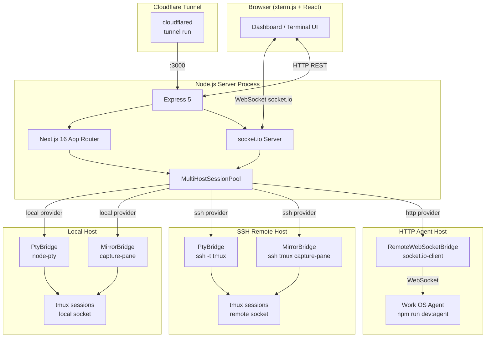
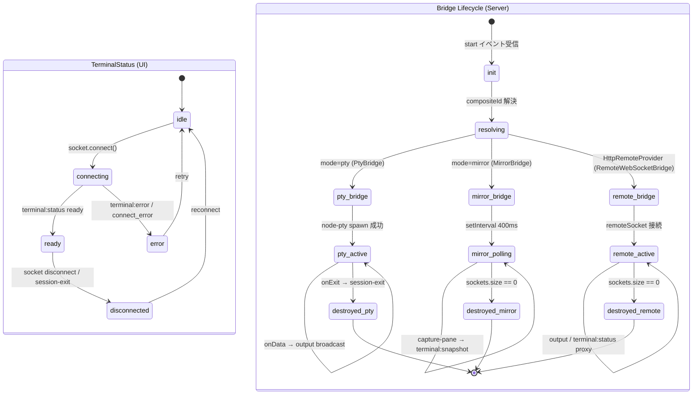
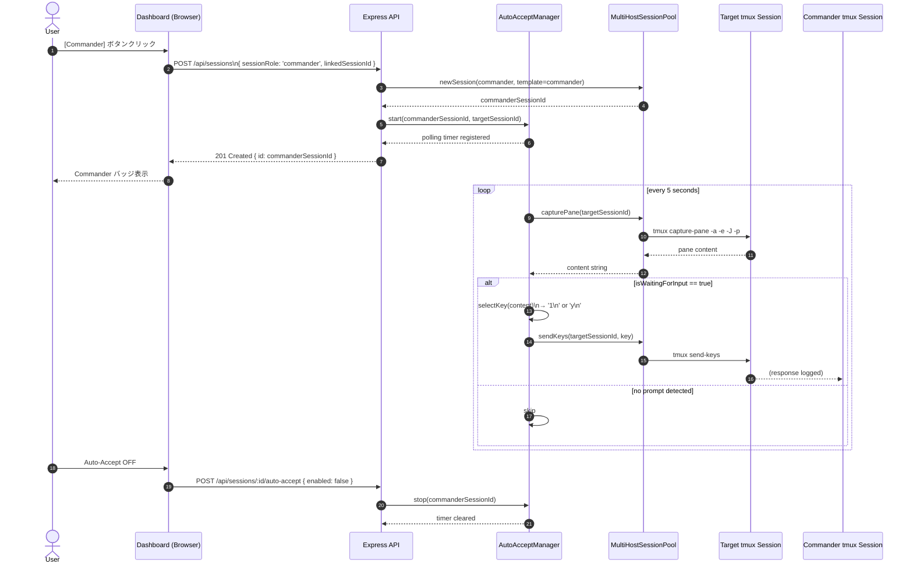
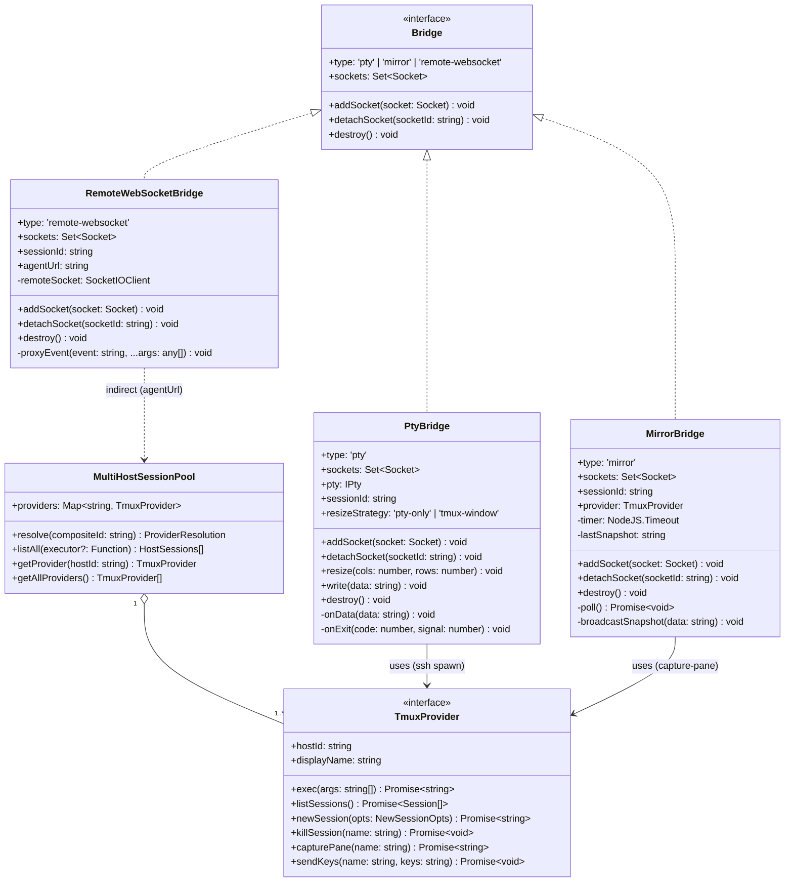

# Work OS — システム仕様書 (SPEC.md)

バージョン: v0.1.22  
作成日: 2026-04-19  
対象リポジトリ: opaopa6969/work-os

---

## 目次

1. [概要](#1-概要)
2. [機能仕様](#2-機能仕様)
3. [データ永続化層](#3-データ永続化層)
4. [ステートマシン](#4-ステートマシン--terminal-session-lifecycle)
5. [ビジネスロジック](#5-ビジネスロジック)
6. [API / 外部境界](#6-api--外部境界)
7. [UI](#7-ui)
8. [設定](#8-設定)
9. [依存関係](#9-依存関係)
10. [非機能要件](#10-非機能要件)
11. [テスト戦略](#11-テスト戦略)
12. [デプロイ / 運用](#12-デプロイ--運用)

---

## 1. 概要

Work OS は **tmux セッションの Web ブラウザ管理ダッシュボード** である。  
ローカルホスト・SSH リモートホスト・HTTP エージェントホストという複数のホストにわたる tmux セッションを単一 URL から可視化・操作できる。

### 1.1 アーキテクチャ概略

```
Browser (xterm.js + React)
    ↕  WebSocket (socket.io)
Express 5 + socket.io Server  ← Node.js single process
    ↕  HTTP (Next.js 16 App Router)
    ↕  PTY (node-pty) / SSH / HTTP Agent
tmux sessions (local / SSH / WSL)
    ↕  Cloudflare Tunnel (外部公開)
```

- **フロントエンド**: Next.js 16 App Router (React 19 / `'use client'`)
- **バックエンド**: Express 5 + custom server (`src/server.ts`)、Next.js の API Routes と共存
- **リアルタイム通信**: socket.io 4 (WebSocket)
- **ターミナル**: node-pty + xterm.js 5
- **マルチホスト**: `MultiHostSessionPool` が複数の `TmuxProvider` を統合管理

### 1.2 起動フロー

1. `npm run dev` / `npm run start` → `src/server.ts` がエントリポイント
2. `app.prepare()` (Next.js) が完了後、Express server + socket.io が起動
3. `buildSessionPool()` が環境変数 `WORK_OS_HOSTS` を読み込み、プロバイダを初期化
4. ポート `PORT`（デフォルト 4000、本番では 3000/5000）で `0.0.0.0` リッスン

### 1.3 マルチホスト アーキテクチャ図



---

## 2. 機能仕様

### 2.1 セッション一覧 (Commander Dashboard)

| 機能 | 説明 |
|------|------|
| セッション自動更新 | ページロード後 `setInterval` でポーリング（3 秒間隔）|
| マルチホスト表示 | `hostId`:`sessionName` の composite ID でホストをまたぐ一覧 |
| ソート | Activity / Created / Name の 3 モード |
| セッション起動 | `POST /api/sessions` でコマンド・CWD・テンプレートを指定して新規起動 |
| セッション終了 | `DELETE /api/sessions/:id` で tmux kill-session |
| シェル起動 | `POST /api/sessions/:id/shell` — 同 CWD で `bash` セッションを派生起動 |
| コンテンツプレビュー | 各カードに直近 N 行の ANSI→HTML 変換プレビュー表示 |
| Auto-Yes | `isWaitingForInput` 検出時に自動で `y Enter` 送信 |
| Orchestration (Proxy) | 別セッション（別 AI エージェント）に context を渡して回答を中継 |
| Commander Agent | 専用 Commander セッションを起動し対象セッションを自動監視 |
| クライアント管理 | Detach / Kill PID / Detach All — `GET/POST /api/sessions/:id/clients` |
| パスコピー | currentPath をクリップボードにコピー |

### 2.2 ターミナルアタッチ

ユーザーがセッションカードを展開すると `Terminal` コンポーネントが描画され、socket.io 経由でセッションにアタッチされる。

**接続モード** (`preferredMode`):

| モード | 動作 |
|--------|------|
| `auto` | 既存アタッチクライアントがいれば mirror、shell コマンドなら pty |
| `attach` | 常に PTY attach (tmux attach-session) |
| `resize-client` | PTY attach + tmux resize-window でウィンドウサイズを同期 |
| `mirror` | capture-pane ポーリング 400ms、読み書き可 |
| `readonly-mirror` | mirror と同じだが input を無効化 |

### 2.3 Commander Agent

Commander は「監視役」として別の AI エージェントセッション（target）を管理する役割を持つ。

- `POST /api/sessions` で `sessionRole: 'commander'` と `linkedSessionId` を指定して起動
- `POST /api/sessions/:id/auto-accept` で AutoAccept ポーリングを起動
- AutoAcceptManager が target の capture-pane を 5 秒間隔で確認
- `(y/n)` や番号選択プロンプトを検出したら自動応答（`1\n` または `y\n`）

### 2.4 テンプレート (Personality)

エージェントの「性格」を AGENT.MD ファイルで定義する。

- `templates/defaults/{ja,en}/{standard,bug-hunter,arch-consultant,commander,doc-expert}/`
- ユーザーカスタマイズ: `templates/user/<name>/`
- セッション起動時に runtime instruction (`AGENT.MD`) をセッション専用パスに生成
- Commander テンプレートは部下エージェントへの指示方法を定義

---

## 3. データ永続化層

Work OS は **基本的にインメモリ動作** であり、永続的なデータベースを持たない。

### 3.1 インメモリストア

| ストア | 型 | 内容 |
|--------|----|------|
| `bridges` | `Map<string, Bridge>` | アクティブな PTY/Mirror/RemoteWS ブリッジ |
| `socketToSession` | `Map<string, string>` | socket.id → composite session ID |
| `sessionStore.metadata` | `Map<string, SessionMetadata>` | Commander/Target リンク情報 |
| `autoAcceptManager.timers` | `Map<string, NodeJS.Timeout>` | 自動承認ポーリングタイマー |
| `_pool` | `MultiHostSessionPool \| null` | プロバイダプール（シングルトン） |

すべてのインメモリストアは **プロセス再起動でリセット** される。

### 3.2 ファイルキャッシュ

| パス | 内容 | 書き込みタイミング |
|------|------|------------------|
| `$WORK_OS_RUNTIME_DIR/<session>/AGENT.MD` | Runtime instruction | セッション起動時 (POST /api/sessions) |
| `$WORK_OS_RUNTIME_DIR/<session>/session.json` | Session metadata JSON | セッション起動時 |
| `templates/user/<name>/AGENT.MD` | カスタムテンプレート | テンプレート init/duplicate 時 |
| `templates/user/<name>/description.md` | テンプレート説明文 | テンプレート init/duplicate 時 |

`WORK_OS_RUNTIME_DIR` のデフォルトは `/tmp/workos-runtime/sessions`（コンテナ再起動で消える）。

### 3.3 tmux セッション情報

tmux 自体が Session metadata を保持する。カスタム option として以下を保存:

| tmux option | 内容 |
|-------------|------|
| `@workos_command` | 起動コマンド文字列 |
| `@workos_directory` | 起動ディレクトリ |
| `@workos_role` | テンプレート名 |
| `@workos_instruction_path` | Runtime AGENT.MD パス |

これらは `provider.exec(['set-option', '-t', sessionName, ...])` で書き込まれ、セッション一覧 API の `-F` フォーマット文字列で読み出される。tmux プロセスが生存している限り保持される（プロセス外の永続化なし）。

---

## 4. ステートマシン — Terminal Session Lifecycle

### 4.1 UI 状態 (TerminalStatus)

```
idle
  → connecting   (socket.connect 発火)
    → connecting (start イベント送信後)
      → ready    (terminal:status { state: 'ready' } 受信)
      → error    (terminal:error 受信 / connect_error)
    → disconnected (socket disconnect / session-exit)
  → error
```

### 4.2 ブリッジライフサイクル (Bridge)

```
[socket: start イベント受信]
        ↓
resolve(compositeId) → provider + sessionName
        ↓
HttpRemoteProvider?
  ├─YES→ ensureRemoteWebSocketBridge() → RemoteWebSocketBridge
  └─NO→ getSessionInfo() → mode判定
              ↓
        mode === 'mirror'?
          ├─YES→ ensureMirrorBridge()
          │       → setInterval 400ms (capture-pane)
          │       → terminal:snapshot ブロードキャスト
          └─NO→  ensurePtyBridge()
                  → node-pty spawn (tmux attach-session / ssh)
                  → onData → output ブロードキャスト
                  → onExit → session-exit ブロードキャスト
                            → bridge 削除

[socket disconnect]
        ↓
detachSocket(socket.id)
  → bridge.sockets から削除
  → sockets.size === 0?
      ├─mirror → clearInterval + bridges.delete
      ├─remote-websocket → remoteSocket.disconnect + bridges.delete
      └─pty → ブリッジは残存 (他ソケットが接続中の可能性)
```

### 4.3 TerminalStatus / Bridge ライフサイクル (stateDiagram-v2)



### 4.4 セッションモード自動判定ロジック

```
getSessionInfo(provider, sessionName, preferredMode):
  attachedCount = tmux display-message #{session_attached}
  currentCommand = #{pane_current_command}
  isShellCommand = command in [bash, sh, zsh, fish]
  isChildShell = sessionId.startsWith('sh-')

  detectedMode:
    attachedCount > 0 OR (not isShellCommand AND not isChildShell) → 'mirror'
    else → 'pty'

  finalMode:
    preferredMode ∈ {mirror, readonly-mirror} → 'mirror'
    preferredMode ∈ {attach, resize-client}   → 'pty'
    else → detectedMode
```

---

## 5. ビジネスロジック

### 5.1 MultiHostSessionPool

`src/lib/tmux-provider.ts` に実装。複数の `TmuxProvider` を統合し composite session ID (`hostId:sessionName`) で一意に解決する。

```typescript
class MultiHostSessionPool {
  providers: Map<string, TmuxProvider>

  resolve(compositeId): { provider, sessionName }
  listAll(executor): { hostId, displayName, sessions[] }[]
  getProvider(hostId): TmuxProvider | undefined
  getAllProviders(): TmuxProvider[]
}
```

**composite ID 解決ルール**: `hostId:sessionName` 形式なら分割、`sessionName` のみなら `local` をデフォルトとする。

### 5.2 TmuxProvider 実装

| クラス | hostId | 動作 |
|--------|--------|------|
| `DefaultSocketProvider` | `local` | `execFileSync('tmux', args)` — デフォルトソケット |
| `ExplicitSocketProvider` | `local` | `execFileSync('tmux', ['-S', socketPath, ...args])` |
| `SshTmuxProvider` | 任意 | SSH 越しに tmux コマンドを実行。`ls` は全ソケット `/tmp/tmux-*/default` をスキャン |
| `HttpRemoteProvider` | 任意 | curl で HTTP API を呼び出し tmux コマンドをマッピング |

**プロバイダ解決優先度** (`resolveTmuxProvider`):
1. `TMUX_SOCKET` 環境変数 → `ExplicitSocketProvider`
2. デフォルトソケット (`tmux ls` 疎通確認)
3. `/tmp/tmux-<uid>/default` を順に試行
4. すべて失敗 → `DefaultSocketProvider` を返す（エラーはコマンド実行時に発生）

### 5.3 PtyBridge

- `node-pty` で `tmux attach-session -t <sessionId>` を spawn
- SSH ホストの場合: `ssh -t <target> tmux -S <socket> attach-session -t <sessionId>`
- `onData` → 全接続 socket に `output` イベントをブロードキャスト
- `onExit` → `session-exit` イベント送信後 bridge 削除
- `resize` イベント受信時: PTY をリサイズ + `resizeStrategy === 'tmux-window'` なら `tmux resize-window` も実行

### 5.4 MirrorBridge

- `setInterval` 400ms で `capture-pane -a -e -J -p -t <sessionId>` を実行
- スナップショットが前回と同一なら送信スキップ（差分最適化）
- 変化があれば `terminal:snapshot` イベントで全接続 socket にフルスナップショットを送信
- ソケットが 0 になると即座に `clearInterval` + bridge 削除

### 5.5 RemoteWebSocketBridge

- `socket.io-client` で別の Work OS インスタンス (`HttpRemoteProvider.agentUrl`) に接続
- `start` イベントを送信後、リモートの `output` / `session-exit` / `terminal:error` / `terminal:status` をローカル socket にプロキシ
- `command` / `resize` はリモートへ中継
- ソケットが 0 になると `remoteSocket.disconnect()` + bridge 削除

### 5.6 sendMirrorData (Mirror モード入力変換)

Mirror モードでユーザー入力を tmux `send-keys` に変換する。

| 入力文字 | tmux send-keys 変換 |
|----------|-------------------|
| `\u001b[A/B/C/D` | Up / Down / Right / Left |
| `\r` | Enter |
| `\u007f` | BSpace |
| `\t` | Tab |
| `\u0003` | C-c |
| `\u001b` | Escape |
| その他印字可能文字 | `-l` (literal) でバッファリング送信 |

### 5.7 AutoAcceptManager

`src/lib/auto-accept.ts` に実装。Commander セッションが target セッションのプロンプトを自動処理する。

```
start(commanderSessionId, targetSessionId, pool):
  setInterval(5000, pollAndRespond)

pollAndRespond:
  capture-pane → isWaitingForInput?
    YES → selectKey → sendKey
    NO  → skip

isWaitingForInput:
  /[Yy]\/[Nn]/ OR /\d+\.\s+[A-Za-z]/ OR /●\s*\d+\./ OR /\?$/ OR shell prompt

selectKey:
  /1\. allow|1\. yes|● 1\./ → '1\n'
  default → 'y\n'
```

### 5.8 Commander Agent Auto-Accept シーケンス図



### 5.9 SessionStore

`src/lib/session-store.ts` に実装。Commander/Target セッションペアをインメモリで管理するシングルトン。

```typescript
interface SessionMetadata {
  role?: 'commander' | 'target' | 'regular'
  linkedSessionId?: string
}

sessionStore.linkCommander(commanderId, targetId)
sessionStore.unlinkCommander(commanderId)
sessionStore.getAllLinks(): { commander, target }[]
```

### 5.10 Bridge クラス図



---

## 6. API / 外部境界

### 6.1 REST API 一覧

| Method | Path | 説明 |
|--------|------|------|
| `GET` | `/api/sessions` | 全ホストのセッション一覧を並行取得 |
| `POST` | `/api/sessions` | 新規 tmux セッション起動 |
| `GET` | `/api/sessions/:id` | セッション内容 capture + isWaitingForInput 判定 |
| `DELETE` | `/api/sessions/:id` | セッション kill |
| `POST` | `/api/sessions/:id/send-key` | tmux send-keys |
| `POST` | `/api/sessions/:id/shell` | 同 CWD で bash セッション派生起動 |
| `GET` | `/api/sessions/:id/clients` | tmux list-clients |
| `POST` | `/api/sessions/:id/clients` | クライアント操作 (detach / detach-all / kill) |
| `GET` | `/api/sessions/:id/auto-accept` | AutoAccept 状態取得 |
| `POST` | `/api/sessions/:id/auto-accept` | AutoAccept 有効化/無効化 |
| `GET` | `/api/templates` | ユーザーテンプレート一覧 |
| `POST` | `/api/templates` | テンプレート init / duplicate |
| `GET` | `/healthz` | ヘルスチェック (bridge 数返却) |

#### GET /api/sessions レスポンス例

```json
{
  "sessions": [
    {
      "id": "local:claude-agent",
      "name": "claude-agent",
      "hostId": "local",
      "hostName": "Local",
      "created": 1713500000,
      "isAttached": false,
      "command": "claude",
      "directory": "/home/opa/work/myapp",
      "role": "standard",
      "instructionPath": "/tmp/workos-runtime/sessions/claude-agent/AGENT.MD",
      "currentCommand": "claude",
      "currentPath": "/home/opa/work/myapp",
      "clientCount": 0,
      "lastActivity": 1713500100,
      "suggestedMode": "mirror",
      "sessionRole": "target",
      "linkedSessionId": "local:commander-1"
    }
  ]
}
```

#### POST /api/sessions リクエスト

```json
{
  "name": "my-agent",
  "command": "claude",
  "cwd": "/home/opa/work/project",
  "templateName": "standard",
  "hostId": "local",
  "sessionRole": "commander",
  "linkedSessionId": "local:target-session"
}
```

#### POST /api/sessions/:id/clients リクエスト (action)

```json
{ "action": "detach", "tty": "/dev/pts/5" }
{ "action": "kill", "pid": 12345 }
{ "action": "detach-all" }
```

### 6.2 WebSocket イベント一覧

#### Client → Server

| イベント | ペイロード | 説明 |
|----------|-----------|------|
| `start` | `{ sessionId, cols, rows, preferredMode }` | セッションへのアタッチ開始 |
| `command` | `{ data: string }` | ターミナル入力 |
| `resize` | `{ cols, rows }` | ターミナルリサイズ |

#### Server → Client

| イベント | ペイロード | 説明 |
|----------|-----------|------|
| `terminal:status` | `{ state, sessionId, message, readOnly }` | 接続状態通知 |
| `output` | `string` | PTY 出力データ (バイナリエスケープ含む) |
| `terminal:snapshot` | `{ sessionId, data: string }` | Mirror モードのフルスナップショット |
| `terminal:error` | `{ sessionId?, message }` | エラー通知 |
| `session-exit` | `{ sessionId, exitCode, signal }` | セッション終了通知 |

`terminal:status.state` の値:
- `connected` — socket.io 接続確立直後
- `ready` — tmux セッションアタッチ完了
- `error` — エラー状態

### 6.3 ヘルスチェック

`GET /healthz` レスポンス:

```json
{
  "ok": true,
  "sessions": 5,
  "pty": 2,
  "mirror": 2,
  "remote-websocket": 1
}
```

---

## 7. UI

### 7.1 ページ構成

| ファイル | 役割 |
|----------|------|
| `src/app/page.tsx` | メインダッシュボード (全機能の UI) |
| `src/app/layout.tsx` | ルートレイアウト (グローバル CSS 適用) |
| `src/app/globals.css` | グローバルスタイル |
| `src/app/page.module.css` | ページスコープスタイル |
| `src/components/Terminal.tsx` | ターミナルコンポーネント |

### 7.2 セッション一覧画面

- ダークテーマ (背景 `#08111f`、テキスト `#d7e3f4`)
- 各セッションがカード形式で表示
- Activity tone: 60 秒以内 → 緑、5 分以内 → 黄、それ以降 → グレー
- Client count badge で接続中クライアント数を表示
- `isWaitingForInput: true` のカードはソートスコアに `10^12` のブーストが乗り最上位表示
- i18n 対応: `ja` / `en` 切り替え (translations オブジェクト)

**セッションカード内ボタン**:
- `Shell` — 同 CWD で bash セッション起動
- `Auto-Yes` — (y/n) プロンプト自動応答トグル
- `Orchestration` (Proxy) — 相談役セッション選択・中継
- `Commander` — Commander セッション追加モーダル
- `Clients` — tmux クライアント管理ダイアログ
- `Force Attach` / `Sync Size` / `read-only` — ターミナル接続モード切替
- `Kill` — セッション終了確認付き削除

### 7.3 Terminal コンポーネント

`src/components/Terminal.tsx` — xterm.js + socket.io をラップした React コンポーネント。

**Props**:

```typescript
interface TerminalProps {
  sessionId: string
  onClose?: () => void
  preferredMode?: 'auto' | 'attach' | 'resize-client' | 'mirror' | 'readonly-mirror'
  height?: number  // デフォルト 450px
}
```

**内部状態**:
- `TerminalStatus`: `idle | connecting | ready | error | disconnected`
- `readOnly`: サーバーから `terminal:status.readOnly` で設定
- `isAltMode`: xterm バッファ切替 (alternate buffer) を監視

**xterm.js テーマ設定**:
- 背景 `#08111f`、カーソル `#7ce0c3`
- フォント: `"Iosevka Term", "SFMono-Regular", Consolas, monospace`
- フォントサイズ: 15px
- スクロールバック: 10000 行

**ステータスバー** (3 段構成):
1. ツールバー: モードラベル (`NORMAL MODE` / `APP MODE` / `READ ONLY`) + ステータステキスト + Close ボタン
2. ターミナルキャンバス: xterm.js の DOM マウントポイント
3. フッター: ステータステキスト / `cols × rows` / 現在行 / リアルタイム時計

**ResizeObserver** でコンテナのサイズ変化を検知し FitAddon + socket `resize` イベントを送信。

### 7.4 エージェント起動フォーム

- セッション名 / コマンド / ディレクトリ / テンプレート (Personality) を入力
- `Use CWD` ボタンで既存セッションの currentPath を入力欄に転記
- テンプレート init (デフォルトからコピー) / duplicate (ユーザーテンプレートを複製) に対応

### 7.5 Commander モーダル

- 対象セッションを選択して Commander を起動
- Commander 名 / テンプレートを入力
- 起動後は auto-accept が自動有効化される
- ダッシュボードで `⚔️ Commander` バッジと `Watched by:` バッジを表示

---

## 8. 設定

### 8.1 環境変数

| 変数 | デフォルト | 説明 |
|------|-----------|------|
| `PORT` | `4000` (dev) / `3000` (docker) | HTTP ポート |
| `NODE_ENV` | `development` | Next.js 動作モード |
| `TMUX_SOCKET` | なし | 明示的な tmux ソケットパス |
| `TMUX_TMPDIR` | なし | tmux 一時ディレクトリ |
| `TERM` | `xterm-256color` | PTY TERM 環境変数 |
| `WORK_OS_HOSTS` | なし | マルチホスト設定 JSON 配列 |
| `WORK_OS_HOSTS_HVU` | なし | 個別ホスト設定 (フォールバック) |
| `WORK_OS_HOSTS_WSL` | なし | 個別ホスト設定 (フォールバック) |
| `WORK_OS_RUNTIME_DIR` | `/tmp/workos-runtime/sessions` | Runtime instruction 書き込み先 |
| `NEXT_TELEMETRY_DISABLED` | `1` | Next.js テレメトリ無効 |

### 8.2 WORK_OS_HOSTS — マルチホスト設定

`WORK_OS_HOSTS` は JSON 配列で複数のホストを定義する。

#### ローカルホスト (type: local)

```json
[
  {
    "hostId": "local",
    "displayName": "HVU Local",
    "type": "local",
    "socketPath": "/tmp/tmux-1000/default"
  }
]
```

`socketPath` を省略するとデフォルトソケットを自動解決。

#### SSH ホスト (type: ssh)

```json
[
  {
    "hostId": "server1",
    "displayName": "Remote Server",
    "type": "ssh",
    "sshTarget": "opa@192.168.1.100",
    "socketPath": "/tmp/tmux-1000/default"
  }
]
```

`sshTarget` に `-p PORT` を付与してポート指定可能 (例: `"opa@host -p 2222"`)。

SSH 接続オプション (ハードコード):
- `BatchMode=yes` — パスワード入力なし
- `ConnectTimeout=5` — タイムアウト 5 秒
- `ControlMaster=auto` / `ControlPath=/tmp/ssh-wos-%r@%h:%p` / `ControlPersist=60` — 接続多重化
- `StrictHostKeyChecking=accept-new` — 初回ホスト自動受入

#### HTTP エージェントホスト (type: http)

```json
[
  {
    "hostId": "wsl",
    "displayName": "WSL Agent",
    "type": "http",
    "agentUrl": "http://172.29.214.157:3001"
  }
]
```

HTTP エージェントは Work OS のサブセット機能 (agent/) を持つ別プロセスを想定。

### 8.3 docker-compose.yml 設定

```yaml
volumes:
  - /usr/local/bin/tmux:/usr/local/bin/tmux:ro      # ホストの tmux バイナリを使用
  - /tmp/tmux-1000:/tmp/tmux-1000                    # tmux ソケットをバインドマウント
  - /mnt/c/var:/mnt/c/var                            # Windows 共有領域
environment:
  - TMUX_SOCKET=/tmp/tmux-1000/default
  - PORT=3000
```

Cloudflare Tunnel サービスが `app:3000` を外部公開する。

---

## 9. 依存関係

### 9.1 本番依存 (dependencies)

| パッケージ | バージョン | 役割 |
|-----------|-----------|------|
| `next` | 16.1.6 | React SSR フレームワーク / App Router |
| `react` | 19.2.3 | UI ライブラリ |
| `react-dom` | 19.2.3 | React DOM レンダラー |
| `express` | ^5.2.1 | HTTP サーバー (Next.js カスタムサーバー) |
| `socket.io` | ^4.8.3 | WebSocket サーバー |
| `socket.io-client` | ^4.8.3 | WebSocket クライアント (RemoteWS bridge) |
| `node-pty` | ^1.1.0 | PTY プロセス (tmux attach) |
| `xterm` | ^5.3.0 | ブラウザターミナルエミュレータ |
| `xterm-addon-fit` | ^0.8.0 | xterm コンテナフィットアドオン |
| `ansi-to-html` | ^0.7.2 | ANSI エスケープ → HTML 変換 (preview) |
| `fs-extra` | ^11.3.4 | ファイル操作 (テンプレート管理) |
| `ws` | ^8.18.0 | WebSocket (socket.io の内部依存) |
| `@unlaxer/dge-toolkit` | ^1.3.1 | DGE エージェントツールキット |

### 9.2 開発依存 (devDependencies)

| パッケージ | バージョン | 役割 |
|-----------|-----------|------|
| `typescript` | ^5 | 型システム |
| `ts-node` | ^10.9.2 | TypeScript ランタイム実行 |
| `eslint` | ^9 | リンター |
| `eslint-config-next` | 16.1.6 | Next.js ESLint 設定 |
| `@types/node` | ^20 | Node.js 型定義 |
| `@types/react` | ^19 | React 型定義 |
| `@types/express` | ^5.0.6 | Express 5 型定義 |
| `@types/fs-extra` | ^11.0.4 | fs-extra 型定義 |

### 9.3 ランタイム要件

- **Node.js**: 20.x (Dockerfile: `node:20-bookworm-slim`)
- **tmux**: 任意バージョン（`-F` フォーマット対応版を推奨）
- **openssh-client**: SSH プロバイダ使用時
- **Python3 / make / g++**: node-pty ビルド時 (builder ステージのみ)

---

## 10. 非機能要件

### 10.1 認証・認可

> **重大なセキュリティ上の注意**

**本システムには認証機能が一切実装されていない。**

- REST API / WebSocket / healthz エンドポイントはすべて認証なし
- Cloudflare Tunnel を使用して外部公開している場合、URL を知っている誰でも以下が可能:
  - すべての tmux セッション内容の閲覧
  - 任意のセッションへのコマンド送信・キー入力
  - 新規セッションの作成・既存セッションの削除
  - クライアントの強制切断
  - ホスト上の任意プロセスへの SIGTERM 送信 (clients kill)

**推奨対策** (未実装):
- Cloudflare Access による認証ゲート設置
- または Basic 認証 / Token 認証の Express ミドルウェア追加
- ネットワーク分離 (VPN 内のみ公開) の検討

### 10.2 パフォーマンス

| 項目 | 値 | 備考 |
|------|-----|------|
| Mirror ポーリング間隔 | 400ms | `setInterval` |
| AutoAccept ポーリング間隔 | 5000ms | `setInterval` |
| PTY デフォルトサイズ | 120 cols × 32 rows | 接続時に resize |
| SSH ConnectTimeout | 5 秒 | ハードコード |
| SSH ControlPersist | 60 秒 | 接続多重化キープアライブ |
| xterm scrollback | 10000 行 | クライアントサイド |
| socket.io reconnectionAttempts | 5 回 | クライアントサイド |

### 10.3 エラーハンドリング

- プロセスレベル: `uncaughtException` / `unhandledRejection` をログ出力して継続
- ブリッジ操作の例外は基本的に握りつぶしてログ出力
- Mirror Bridge のポーリングエラーは `terminal:error` イベントで通知
- SSH 接続失敗は `tmux ls` エラーを検出し sessions 一覧から除外
- Next.js サーバー初期化失敗は `process.exit(1)`

### 10.4 スケーラビリティ

- **シングルプロセス** 動作: bridge 状態はメモリに保持されるため水平スケールは非対応
- ブリッジは最後のソケット切断後に破棄（メモリリークなし）
- PTY ブリッジは全 socket が切断してもプロセス終了まで残存する（tmux セッション持続のため）

### 10.5 ログ

- `console.log` / `console.error` / `console.warn` によるプレーンテキストログ
- 構造化ログなし、ログレベル管理なし
- Docker の場合は `docker logs` で確認

---

## 11. テスト戦略

### 11.1 現状

本リポジトリには**自動テストが存在しない**。

`package.json` に `test` スクリプトが定義されておらず、テストフレームワーク (Jest / Vitest 等) も devDependencies に含まれていない。

`test-ts-node.ts` と `test-interaction.sh` のファイルが存在するが、これらはアドホックな動作確認スクリプトであり CI/CD パイプラインには組み込まれていない。

### 11.2 推奨テスト設計 (未実装)

#### ユニットテスト対象

| モジュール | テスト内容 |
|-----------|----------|
| `tmux-provider.ts` | `MultiHostSessionPool.resolve()` の composite ID 解析パターン |
| `tmux-provider.ts` | `resolveTmuxProvider()` のソケット解決ロジック |
| `session-store.ts` | `linkCommander` / `unlinkCommander` / `getAllLinks` |
| `auto-accept.ts` | `isWaitingForInput` の正規表現パターン |
| `auto-accept.ts` | `selectKey` の入力選択ロジック |
| `server.ts` | `sendMirrorData` のエスケープ変換ロジック |
| `server.ts` | `sanitizeSessionId` のサニタイズ |

#### 統合テスト対象

| シナリオ | 確認項目 |
|---------|---------|
| REST API | `GET /api/sessions` の shape / statusCode |
| REST API | `POST /api/sessions` → tmux new-session 呼び出し確認 |
| REST API | `DELETE /api/sessions/:id` → tmux kill-session 呼び出し確認 |
| WebSocket | `start` イベント → `terminal:status` `ready` 応答 |
| WebSocket | `command` イベント → pty.write 呼び出し |

#### E2E テスト (Playwright 推奨)

- セッション一覧の表示
- ターミナルへのアタッチと文字入力
- セッション起動から kill まで

### 11.3 CI/CD

現状 CI/CD パイプライン (GitHub Actions 等) は設定されていない。  
推奨: `npm run build` (型チェック + Next.js ビルド + TypeScript コンパイル) を最低限 CI で実行する。

---

## 12. デプロイ / 運用

### 12.1 開発環境

```bash
# 依存インストール
npm install

# 開発サーバー起動 (ts-node で server.ts を直接実行)
npm run dev  # PORT=4000

# HTTP エージェント (WSL 側など)
npm run dev:agent
```

### 12.2 本番ビルド

```bash
npm run build
# = next build + tsc --project tsconfig.server.json + tsc --project tsconfig.agent.json
# 出力: .next/ + dist/server.js + dist/index.js

npm run start
# = NODE_ENV=production node dist/server.js
```

### 12.3 Docker ビルド・起動

```bash
# イメージビルド
docker build -t work-os .

# 単体起動
docker run -d \
  -p 3000:3000 \
  -v /tmp/tmux-1000:/tmp/tmux-1000 \
  -v /usr/local/bin/tmux:/usr/local/bin/tmux:ro \
  -e TMUX_SOCKET=/tmp/tmux-1000/default \
  -e PORT=3000 \
  work-os

# docker-compose 起動 (Cloudflare Tunnel 付き)
docker-compose up -d
```

### 12.4 Docker アーキテクチャ詳細

Dockerfile はマルチステージビルドを採用:

1. **builder** (`node:20-bookworm-slim`): `npm install && npm rebuild && npm run build`
2. **runtime** (`node:20-bookworm-slim`): ビルド成果物 (`.next/`, `dist/`, `node_modules`) のみコピー

tmux バイナリはホストのものをバインドマウント (`/usr/local/bin/tmux:ro`) — コンテナに tmux バイナリ自体は含まれるが、ホストの tmux ソケットを直接利用する。

### 12.5 Cloudflare Tunnel 構成

`docker-compose.yml` に `tunnel` サービスとして定義:

```yaml
image: cloudflare/cloudflared:latest
command: tunnel --cred-file <cred.json> run --url http://app:3000 <tunnel-id>
```

クレデンシャルファイル (`~/.cloudflared/<uuid>.json` および `cert.pem`) をバインドマウントして使用。  
`app` サービスに `depends_on` で依存、常に再起動 (`restart: always`)。

> **注意**: Cloudflare Tunnel は認証なしのまま外部公開する構成になっている。Cloudflare Access ルールを必ず設定すること。

### 12.6 ヘルスチェック

```bash
curl http://localhost:3000/healthz
# {"ok":true,"sessions":3,"pty":1,"mirror":2,"remote-websocket":0}
```

### 12.7 ログ確認

```bash
# Docker
docker logs -f work-os-app

# 直接実行
npm run start 2>&1 | tee app.log
```

### 12.8 セッション状態の確認

Work OS のメタデータは全てインメモリであるため、サーバー再起動後は:
- tmux セッション自体はホストに残存 (tmux はサーバーとは無関係)
- ブリッジ情報 / Commander リンク / AutoAccept 設定はすべてリセット
- ページリロード後に再接続することで通常動作に復帰

### 12.9 マルチホスト運用手順

1. 各ホストの SSH 鍵を `~/.ssh/authorized_keys` に登録
2. `WORK_OS_HOSTS` 環境変数に JSON 配列を設定
3. SSH ControlMaster によって接続多重化が自動で行われる
4. リモートホストの tmux ソケット `/tmp/tmux-*/default` を自動スキャン

HTTP エージェント (`type: http`) を使用する場合:
1. 対象ホストで `npm run dev:agent` または `npm run start:agent` を起動
2. `agentUrl` に `http://<host>:<port>` を設定

---

---

## 付録 A: ソースコード詳細リファレンス

### A.1 ファイル構成ツリー

```
work-os/
├── src/
│   ├── server.ts                         # エントリポイント: Express + socket.io + Next.js
│   ├── app/
│   │   ├── layout.tsx                    # ルートレイアウト
│   │   ├── page.tsx                      # メインダッシュボード (SPA)
│   │   ├── globals.css
│   │   ├── page.module.css
│   │   └── api/
│   │       ├── sessions/
│   │       │   ├── route.ts              # GET (一覧) / POST (起動)
│   │       │   └── [id]/
│   │       │       ├── route.ts          # GET (capture) / DELETE (kill)
│   │       │       ├── send-key/
│   │       │       │   └── route.ts      # POST (send-keys)
│   │       │       ├── shell/
│   │       │       │   └── route.ts      # POST (bash 派生)
│   │       │       ├── clients/
│   │       │       │   └── route.ts      # GET (list) / POST (detach/kill)
│   │       │       └── auto-accept/
│   │       │           └── route.ts      # GET / POST (auto-accept 制御)
│   │       └── templates/
│   │           └── route.ts              # GET / POST (init/duplicate)
│   ├── components/
│   │   └── Terminal.tsx                  # xterm.js コンポーネント
│   └── lib/
│       ├── tmux-provider.ts              # TmuxProvider / MultiHostSessionPool
│       ├── session-store.ts              # Commander/Target セッションリンク
│       └── auto-accept.ts               # AutoAcceptManager
├── templates/
│   ├── defaults/
│   │   ├── ja/
│   │   │   ├── standard/
│   │   │   ├── bug-hunter/
│   │   │   ├── arch-consultant/
│   │   │   ├── commander/
│   │   │   └── doc-expert/
│   │   └── en/
│   │       └── (同構成)
│   └── user/                             # ユーザーカスタムテンプレート
├── agent/                                # HTTP エージェント (WSL 等)
├── dist/                                 # TypeScript ビルド出力
├── .next/                                # Next.js ビルド出力
├── Dockerfile
├── docker-compose.yml
├── package.json
├── tsconfig.json
├── tsconfig.server.json
└── tsconfig.agent.json
```

### A.2 TypeScript 型定義詳細

#### server.ts — 型定義

```typescript
// セッション操作モード
type SessionMode = 'pty' | 'mirror'
type SessionModePreference = 'auto' | 'mirror' | 'readonly-mirror' | 'attach' | 'resize-client'

// tmux セッション情報
type SessionInfo = {
  sessionId: string           // 実際の tmux セッション名
  attachedCount: number       // #{session_attached}
  currentCommand: string      // #{pane_current_command}
  currentPath: string         // #{pane_current_path}
  mode: SessionMode           // 決定された接続モード
  reason: string              // モード決定理由
  resizeStrategy: 'pty-only' | 'tmux-window'
  readOnly: boolean           // readonly-mirror の場合 true
}

// PTY ブリッジ (tmux attach-session)
type PtyBridge = {
  sessionId: string           // composite ID ("hostId:sessionName")
  mode: 'pty'
  ptyProcess: pty.IPty        // node-pty プロセス
  sockets: Set<string>        // 接続中の socket.id
  createdAt: number
  lastActiveAt: number
  resizeStrategy: 'pty-only' | 'tmux-window'
  readOnly: boolean
}

// Mirror ブリッジ (capture-pane ポーリング)
type MirrorBridge = {
  sessionId: string
  mode: 'mirror'
  sockets: Set<string>
  createdAt: number
  lastActiveAt: number
  pollTimer: NodeJS.Timeout   // 400ms インターバル
  lastSnapshot: string        // 差分検知用キャッシュ
  info: SessionInfo
  resizeStrategy: 'pty-only' | 'tmux-window'
  readOnly: boolean
}

// RemoteWebSocket ブリッジ (HTTP エージェントへのプロキシ)
type RemoteWebSocketBridge = {
  sessionId: string
  mode: 'remote-websocket'
  sockets: Set<string>
  createdAt: number
  lastActiveAt: number
  remoteSocket: any           // socket.io-client Socket
  info: SessionInfo
  resizeStrategy: 'pty-only' | 'tmux-window'
  readOnly: boolean
}

type Bridge = PtyBridge | MirrorBridge | RemoteWebSocketBridge
```

#### session-store.ts — 型定義

```typescript
export interface SessionMetadata {
  role?: 'commander' | 'target' | 'regular'
  linkedSessionId?: string
}
```

#### Terminal.tsx — 型定義

```typescript
interface TerminalProps {
  sessionId: string
  onClose?: () => void
  syncSize?: boolean
  preferredMode?: 'auto' | 'attach' | 'resize-client' | 'mirror' | 'readonly-mirror'
  height?: number  // default: 450
}

type TerminalStatus = 'idle' | 'connecting' | 'ready' | 'error' | 'disconnected'
```

#### page.tsx — Session インターフェース

```typescript
interface Session {
  id: string                  // composite ID ("hostId:name")
  name: string                // tmux セッション名
  hostId?: string
  hostName?: string
  isAttached: boolean
  lastActivity?: number       // unix epoch seconds
  command?: string            // @workos_command
  directory?: string          // @workos_directory
  currentCommand?: string     // #{pane_current_command}
  currentPath?: string        // #{pane_current_path}
  clientCount?: number
  suggestedMode?: 'attach' | 'mirror'
  isWaitingForInput?: boolean  // capture-pane 解析結果
  lastLine?: string
  content?: string             // capture-pane フルコンテンツ
  summary?: string             // UI 用要約テキスト
  sessionRole?: 'commander' | 'target' | 'regular'
  linkedSessionId?: string
}
```

### A.3 グローバル状態管理

`src/server.ts` はプロセスグローバルに以下の状態を持つ:

```typescript
// アクティブブリッジマップ (key: composite ID)
const bridges = new Map<string, Bridge>()

// socket → composite session ID マッピング
const socketToSession = new Map<string, string>()

// セッションプール (シングルトン、buildSessionPool() で初期化)
const sessionPool = buildSessionPool()
```

`src/lib/tmux-provider.ts` のモジュールレベル変数:

```typescript
let _resolved: TmuxProvider | null = null  // resolveTmuxProvider() キャッシュ
let _pool: MultiHostSessionPool | null = null  // buildSessionPool() キャッシュ
```

Next.js App Router の Route Handlers は**別のモジュールコンテキスト**で実行されるため、`sessionStore` と `autoAcceptManager` はそれぞれのモジュールでシングルトンとして管理される:

```typescript
// session-store.ts
export const sessionStore = new SessionStore()

// auto-accept.ts
export const autoAcceptManager = new AutoAcceptManager()
```

### A.4 セッション ID 命名規則

| パターン | 説明 | 例 |
|---------|------|----|
| `<name>` | ローカル単体 (composite: `local:<name>`) | `claude-agent` |
| `local:<name>` | ローカル explicit | `local:claude-agent` |
| `<hostId>:<name>` | リモートホスト | `server1:my-session` |
| `sh-<parent>-<4digits>` | Shell 派生セッション | `sh-claude-agent-4521` |
| `claude-<4digits>` | クイック Claude 起動 | `claude-4521` |
| `gemini-<4digits>` | クイック Gemini 起動 | `gemini-3887` |

`sanitizeSessionId` (server.ts):
- 英数字 / `.` / `_` / `-` のみ許可
- 最大 120 文字

`sanitizeSessionName` (route.ts):
- 英数字 / `.` / `_` / `-` のみ許可、それ以外は `-` に置換
- 最大 120 文字

---

## 付録 B: テンプレート (Personality) システム詳細

### B.1 テンプレートディレクトリ構造

```
templates/
├── defaults/
│   ├── ja/                               # 日本語テンプレート
│   │   ├── standard/
│   │   │   ├── AGENT.MD                 # システムプロンプト
│   │   │   ├── description.md           # UI 表示用説明
│   │   │   └── docs/
│   │   │       ├── memory.md            # 記憶・引継ぎドキュメント
│   │   │       ├── specs.md             # 仕様書テンプレート
│   │   │       ├── backlog.md           # バックログテンプレート
│   │   │       ├── architecture.md      # アーキテクチャテンプレート
│   │   │       └── permissions.md       # 権限設定テンプレート
│   │   ├── bug-hunter/
│   │   │   ├── AGENT.MD
│   │   │   ├── description.md
│   │   │   └── docs/memory.md
│   │   ├── arch-consultant/
│   │   │   ├── AGENT.MD
│   │   │   ├── description.md
│   │   │   └── docs/memory.md
│   │   ├── commander/
│   │   │   ├── AGENT.MD
│   │   │   ├── description.md
│   │   │   └── docs/memory.md
│   │   └── doc-expert/
│   │       ├── AGENT.MD
│   │       ├── description.md
│   │       └── docs/memory.md
│   └── en/                               # 英語テンプレート (同構成)
└── user/                                 # ユーザーカスタムテンプレート
    └── <name>/
        ├── AGENT.MD
        └── description.md
```

### B.2 各テンプレートの役割

#### Standard (`ja/standard`)

汎用ソフトウェアエンジニア。設計からリリースまでを担当する全方位エンジニア役。

主要ルール:
- `docs/memory.md` によるセッション間の記憶継承
- `docs/specs.md` / `docs/architecture.md` の参照・更新
- `docs/permissions.md` による権限チェック
- `docs/backlog.md` での進捗管理
- Conventional Commits による git コミット
- `CHANGELOG.md` のバージョン管理

#### Bug Hunter (`ja/bug-hunter`)

QA エンジニア兼デバッガー役。不具合調査・修正・テスト作成に特化。

主要ルール:
- 根本原因 (Root Cause) 特定まで修正しない
- バグ再現の最小テストコード作成
- 修正後のデグレード確認
- `CHANGELOG.md` に `fix:` として記録

#### Arch Consultant (`ja/arch-consultant`)

最高位システムアーキテクト役。コードを書かず、構造設計と比較検討に集中。

主要ルール:
- 常に A案/B案 複数選択肢とトレードオフを提示
- Mermaid 記法によるコンポーネント図・シーケンス図の積極活用
- SOLID / DRY / KISS 設計原則に基づく根拠ある提案
- 全決定事項を `docs/architecture.md` に集約
- 明確な指示があるまでコード実装しない

#### Commander (`ja/commander`)

プロジェクト最高指揮官役。複数エージェントを指揮・調整。

主要ルール:
- Worker (部下エージェント) への具体的指示と解決策提示
- ユーザー直接入力は絶対最優先
- `[USER]` タグ付きコンテキストをユーザーの意志として扱う
- 全体像把握と Worker 間の競合防止
- Y/N 判断をプロジェクト設計思想に照らして実行
- 自己判断不可能な問題はユーザーに相談

#### Doc Expert (`ja/doc-expert`)

プロフェッショナルテクニカルライター役。ドキュメント整備に特化。

主要ルール:
- コードとドキュメントの完全一致を保証
- 専門用語を抑え簡潔な表現を選択
- 用語・文体のプロジェクト全体統一
- 適切な章立て・リンク・コードブロック・図解
- 陳腐化箇所のスキャンと補完
- `CHANGELOG.md` に `docs:` として記録

### B.3 Runtime Instruction 生成ロジック

`POST /api/sessions` でテンプレートが指定された場合、`buildRuntimeInstruction()` が呼ばれる:

```
入力:
  templateDir: string (解決済みテンプレートディレクトリパス)
  sessionName: string
  cwd: string
  command: string
  roleName: string

処理:
  1. runtimeDir = $WORK_OS_RUNTIME_DIR/<sessionName>/ を作成
  2. templateDir/AGENT.MD を読み込み
  3. cwd 内の baseline docs を探索
     対象: README.md, specs.md, architecture.md, backlog.md, CHANGELOG.md
  4. Runtime instruction を合成:
     - Session Context (名前/CWD/コマンド/ロール)
     - Operating Rules (runtime instruction としての注意)
     - Project Baseline Docs (見つかったファイルのパス一覧)
     - Role Template (AGENT.MD の内容)
  5. runtimeDir/AGENT.MD に書き込み
  6. runtimeDir/session.json にメタデータを JSON 保存

出力:
  { runtimeDir, instructionPath }
```

合成後の `instructionPath` は:
- tmux `new-session` コマンドの引数として渡される (`[command, instructionPath]`)
- `@workos_instruction_path` tmux オプションに記録される

### B.4 テンプレート名の解決ロジック

```typescript
function resolveTemplateDir(templateName?: string): string | null {
  // 1. ユーザーテンプレートを優先確認
  userPath = templates/user/<templateName>
  if exists(userPath): return userPath

  // 2. "<baseName>-<lang>" パターンで defaults を検索
  match = templateName.match(/^(.*)-([a-z]{2})$/i)
  if match:
    [baseName, lang] = match
    defaultPath = templates/defaults/<lang>/<baseName>
    if exists(defaultPath): return defaultPath

  return null
}
```

例: `templateName = "standard-ja"` → `templates/defaults/ja/standard/` を返す

---

## 付録 C: WebSocket 通信フロー詳細

### C.1 PTY モード接続フロー

```
Browser                    Server                    tmux
  |                           |                        |
  |-- socket.io connect ----->|                        |
  |<-- terminal:status -------|                        |
  |   { state:'connected' }   |                        |
  |                           |                        |
  |-- start { sessionId,      |                        |
  |   cols, rows, mode } ---->|                        |
  |                           |-- resolve(compositeId) |
  |                           |-- getSessionInfo() --->|
  |                           |                        |
  |                           |-- node-pty.spawn ------>|
  |                           |   tmux attach-session  |
  |                           |                        |
  |<-- terminal:status -------|                        |
  |   { state:'ready' }       |                        |
  |                           |                        |
  |                           |<-- pty onData ---------|
  |<-- output (raw) -----------|                        |
  |                           |                        |
  |-- command { data } ------>|                        |
  |                           |-- pty.write(data) ---->|
  |                           |                        |
  |-- resize { cols, rows } ->|                        |
  |                           |-- pty.resize() ------->|
  |                           |   [+ tmux resize-window]|
  |                           |                        |
  |-- disconnect              |                        |
  |                           |-- detachSocket()       |
  |                           |   (pty bridge 残存)    |
```

### C.2 Mirror モード接続フロー

```
Browser                    Server                    tmux
  |                           |                        |
  |-- socket.io connect ----->|                        |
  |<-- terminal:status -------|                        |
  |   { state:'connected' }   |                        |
  |                           |                        |
  |-- start { sessionId,      |                        |
  |   mode:'mirror' } ------->|                        |
  |                           |-- getSessionInfo()     |
  |                           |-- ensureMirrorBridge() |
  |                           |                        |
  |<-- terminal:status -------|                        |
  |   { state:'ready' }       |                        |
  |                           |                        |
  |<-- terminal:snapshot -----|                        |
  |   (初回フルスナップショット)|                        |
  |                           |                        |
  |                           |  [400ms ごと]          |
  |                           |-- capture-pane ------->|
  |                           |<-- output -------------|
  |                           | (変化あり?)             |
  |<-- terminal:snapshot ------|  YES: broadcast       |
  |                           |  NO:  skip             |
  |                           |                        |
  |-- command { data } ------>|                        |
  |                           |-- sendMirrorData()     |
  |                           |-- send-keys -l ------->|
  |                           |   (バッファリング送信)  |
  |                           |                        |
  |-- disconnect              |                        |
  |                           |-- detachSocket()       |
  |                           |-- clearInterval()      |
  |                           |-- bridges.delete()     |
```

### C.3 RemoteWebSocket モード接続フロー

```
Browser           Local Server         Remote Agent (HTTP)
  |                    |                      |
  |-- start ---------->|                      |
  |                    |-- ensureRemoteWS()   |
  |                    |-- ioClient connect ->|
  |                    |<-- connect ----------|
  |                    |-- emit 'start' ----->|
  |                    |                      |
  |<-- terminal:status-|                      |
  |   { state:'ready'} |                      |
  |                    |                      |
  |                    |<-- output -----------|
  |<-- output ---------|                      |
  |                    |                      |
  |-- command -------->|                      |
  |                    |-- emit 'command' --->|
  |                    |                      |
  |-- resize --------->|                      |
  |                    |-- emit 'resize' ---->|
  |                    |                      |
  |-- disconnect       |                      |
  |                    |-- remoteSocket.disconnect()
  |                    |-- bridges.delete()   |
```

### C.4 エラーシナリオ

| シナリオ | イベント | ペイロード |
|---------|---------|----------|
| tmux セッション不在 | `terminal:error` | `{ message: 'host not found: ...' }` |
| PTY spawn 失敗 | `terminal:error` | `{ message: '...' }` |
| Mirror capture 失敗 | `terminal:error` | `{ message: 'failed to capture session' }` |
| PTY プロセス終了 | `session-exit` | `{ sessionId, exitCode, signal }` |
| socket.io 切断 | `disconnect` | — |
| 接続失敗 (client) | `connect_error` | Error オブジェクト |
| readOnly 時の入力 | — | サーバー側で握りつぶし |

---

## 付録 D: API リクエスト/レスポンス完全仕様

### D.1 GET /api/sessions

**クエリパラメータ**: なし

**レスポンス 200**:

```typescript
{
  sessions: Array<{
    id: string                  // "hostId:sessionName"
    name: string
    hostId: string
    hostName: string
    created: number             // unix timestamp (seconds)
    isAttached: boolean
    command: string             // @workos_command
    directory: string           // @workos_directory
    role: string                // @workos_role (templateName)
    instructionPath: string     // @workos_instruction_path
    currentCommand: string      // #{pane_current_command}
    currentPath: string         // #{pane_current_path}
    clientCount: number
    lastActivity: number        // unix timestamp (seconds)
    suggestedMode: 'attach' | 'mirror'
    sessionRole?: 'commander' | 'target' | 'regular'
    linkedSessionId?: string
  }>
}
```

**処理フロー**:
1. `pool.getAllProviders()` で全プロバイダを取得
2. `Promise.allSettled()` で並行実行
3. 各プロバイダで `tmux ls -F '#{session_name}__WORKOS__...'` を実行
4. 各セッションで追加情報を取得:
   - `display-message -p #{pane_current_command}`
   - `display-message -p #{pane_current_path}`
   - `list-clients -F '...'` (clientCount / lastActivity)
5. `sessionStore.getMetadata()` で Commander/Target リンク情報を付与
6. 失敗したプロバイダはスキップ (settled の `rejected` を除外)

**エラーケース**:
- プロバイダ個別エラー: sessions 配列から該当ホスト分が欠落 (部分取得)
- tmux "no server running": 空の sessions 配列を返す

### D.2 POST /api/sessions

**リクエストボディ**:

```typescript
{
  name: string        // セッション名 (必須)
  command: string     // 実行コマンド (必須)
  cwd: string         // 作業ディレクトリ (必須)
  templateName?: string     // テンプレート名
  hostId?: string           // デフォルト: 'local'
  sessionRole?: 'commander' | 'target'
  linkedSessionId?: string  // sessionRole 指定時
}
```

**レスポンス 200**:

```typescript
{
  message: string
  compositeId: string       // "hostId:sessionName"
  sessionName: string
  hostId: string
  cwd: string
  command: string           // 実際に起動したコマンド (テンプレート付きの場合 "command instructionPath")
  instructionPath: string | null
  sessionRole?: string
  linkedSessionId?: string
}
```

**レスポンス 400**:
- `name`, `command`, `cwd` のいずれかが空
- `sessionName` が空文字列 (sanitize 後)
- `hostId` に対応するプロバイダが存在しない

**レスポンス 500**:
- tmux `new-session` コマンド失敗
- ディレクトリ作成失敗 (`fs.ensureDir`)
- テンプレートコピー失敗

**処理フロー**:
1. `sanitizeSessionName()` で名前を正規化
2. `pool.getProvider(hostId)` でプロバイダを取得
3. `fs.ensureDir(cwd)` でディレクトリを作成
4. `resolveTemplateDir(templateName)` でテンプレートを解決
5. テンプレートありの場合 `buildRuntimeInstruction()` で runtime instruction 生成
6. `provider.exec(['new-session', '-d', '-s', sessionName, '-c', cwd, ...cmdTokens])` で起動
7. `set-option` で tmux custom options を設定
8. `sessionRole` / `linkedSessionId` がある場合 `sessionStore.linkCommander()` を呼び出し

### D.3 GET /api/sessions/:id

**パスパラメータ**: `id` = composite session ID

**レスポンス 200**:

```typescript
{
  id: string
  content: string           // capture-pane フル出力
  isWaitingForInput: boolean
  lastLine: string          // content の最終行
  updatedAt: number         // Date.now()
}
```

`isWaitingForInput` 判定ロジック:
- 末尾 5 行を結合して以下の正規表現でチェック:
  - `/([\[\(][y\/n]+[\)\]]|\? |proceed\?|continue\?|ready\?)/i`
  - `/(● \d\. |[1-9]\. allow|[1-9]\. yes|[1-9]\. proceed)/i`

### D.4 DELETE /api/sessions/:id

**レスポンス 200**: `{ message: "Session <id> killed" }`
**レスポンス 500**: capture エラー

処理: `provider.exec(['kill-session', '-t', sessionName])`

### D.5 POST /api/sessions/:id/send-key

**リクエストボディ**: `{ key: string }`

**レスポンス 200**: `{ message: "Sent key: <key> to session: <id>" }`
**レスポンス 400**: key が空

処理: `provider.exec(['send-keys', '-t', sessionName, key])`

### D.6 POST /api/sessions/:id/shell

**リクエストボディ**: なし

**レスポンス 200**:

```typescript
{
  message: string
  newSession: string    // "sh-<parent>-<4digits>"
  compositeId: string
  cwd: string
}
```

処理フロー:
1. `display-message -p #{pane_current_path}` で現在 CWD を取得
2. `sh-<sessionName>-<Date.now()の末尾4桁>` で新しいセッション名を生成
3. `new-session -d -s <newName> -c <cwd> bash` で bash セッション起動

### D.7 GET /api/sessions/:id/clients

**レスポンス 200**:

```typescript
{
  sessionId: string
  raw: string
  clients: Array<{
    name: string
    pid: number
    tty: string
    size: string      // "WxH"
    created: number
    activity: number
    termname: string
    raw: string
  }>
}
```

処理: `list-clients -t <name> -F '#{client_name}\t#{client_pid}\t...'`

### D.8 POST /api/sessions/:id/clients

**リクエストボディ**:

```typescript
{ action: 'detach', tty: string }
{ action: 'kill', pid: number }
{ action: 'detach-all' }
```

**レスポンス 200** (action: detach-all):
```typescript
{ ok: true, action: 'detach-all', sessionId: string, detached: string[] }
```

**action: kill** の実装: `process.kill(targetPid, 'SIGTERM')`

### D.9 GET /api/sessions/:id/auto-accept

**レスポンス 200**:

```typescript
{
  commanderSessionId: string
  enabled: boolean
  targetSessionId?: string
  role?: 'commander' | 'target' | 'regular'
}
```

### D.10 POST /api/sessions/:id/auto-accept

**リクエストボディ**:

```typescript
{ enabled: true, targetSessionId: string }
{ enabled: false }
```

**レスポンス 200** (有効化):
```typescript
{
  message: 'Auto-accept enabled',
  commanderSessionId: string,
  targetSessionId: string
}
```

**レスポンス 404**: 指定セッションが存在しない場合

有効化フロー:
1. 両セッションの存在確認 (`pool.resolve()`)
2. `sessionStore.linkCommander(commanderId, targetId)`
3. `autoAcceptManager.start(commanderId, targetId, pool)`

無効化フロー:
1. `autoAcceptManager.stop(commanderId)`
2. `sessionStore.unlinkCommander(commanderId)`

### D.11 GET /api/templates

**レスポンス 200**:

```typescript
{
  templates: Array<{
    name: string
    description: string  // description.md の内容
  }>
}
```

`templates/user/` ディレクトリが存在しない場合は自動作成。

### D.12 POST /api/templates

**リクエストボディ (action: init)**:

```typescript
{
  action: 'init',
  sourceLang: 'ja' | 'en',
  sourceSubDir: string    // 'standard', 'bug-hunter', etc.
}
```

`templates/defaults/<sourceLang>/<sourceSubDir>/` → `templates/user/<sourceSubDir>-<sourceLang>/` にコピー。

**リクエストボディ (action: duplicate)**:

```typescript
{
  action: 'duplicate',
  sourceName: string,   // 既存ユーザーテンプレート名
  name: string          // 新しいテンプレート名
}
```

**レスポンス 400** (duplicate): コピー先が既に存在する場合

---

## 付録 E: 設定リファレンス完全版

### E.1 tsconfig 設定

**tsconfig.json** (Next.js フロントエンド):
```json
{
  "compilerOptions": {
    "target": "ES2017",
    "lib": ["dom", "dom.iterable", "esnext"],
    "allowJs": true,
    "skipLibCheck": true,
    "strict": true,
    "noEmit": true,
    "esModuleInterop": true,
    "module": "esnext",
    "moduleResolution": "bundler",
    "resolveJsonModule": true,
    "isolatedModules": true,
    "jsx": "preserve",
    "incremental": true,
    "paths": { "@/*": ["./src/*"] }
  }
}
```

**tsconfig.server.json** (Express サーバー):
```json
{
  "compilerOptions": {
    "target": "ES2020",
    "module": "CommonJS",
    "outDir": "./dist",
    "esModuleInterop": true,
    "strict": true,
    "skipLibCheck": true
  },
  "include": ["src/server.ts", "src/lib/**/*"]
}
```

**tsconfig.agent.json** (HTTP エージェント):
```json
{
  "compilerOptions": {
    "target": "ES2020",
    "module": "CommonJS",
    "outDir": "./dist",
    "esModuleInterop": true,
    "strict": true,
    "skipLibCheck": true
  },
  "include": ["agent/**/*"]
}
```

### E.2 next.config の設定

`next.config.ts` (または `next.config.js`) — 標準的な Next.js 設定。特殊な設定は行われていない。

### E.3 eslint.config.mjs

`eslint-config-next` を使用した標準設定。

### E.4 docker-compose.yml 完全版

```yaml
services:
  app:
    build: .
    container_name: work-os-app
    ports:
      - "2990:3000"    # ホスト2990番 → コンテナ3000番
    restart: no         # 手動管理 (クラッシュ時自動再起動なし)
    volumes:
      - /usr/local/bin/tmux:/usr/local/bin/tmux:ro    # ホストの tmux バイナリ
      - /tmp/tmux-1000:/tmp/tmux-1000                 # tmux ソケット共有
      - /mnt/c/var:/mnt/c/var                         # Windows 共有領域
    environment:
      - NODE_ENV=production
      - PORT=3000
      - HOSTNAME=0.0.0.0
      - TMUX_SOCKET=/tmp/tmux-1000/default
      - TMUX_TMPDIR=/tmp
      - NEXT_TELEMETRY_DISABLED=1
      - PATH=/usr/local/sbin:/usr/local/bin:/usr/sbin:/usr/bin:/sbin:/bin

  tunnel:
    image: cloudflare/cloudflared:latest
    container_name: work-os-tunnel
    user: root
    restart: always     # 常時再起動
    volumes:
      - /home/opa/.cloudflared/<uuid>.json:/etc/cloudflared/<uuid>.json:ro
      - /home/opa/.cloudflared/cert.pem:/etc/cloudflared/cert.pem:ro
    command: tunnel --cred-file /etc/cloudflared/<uuid>.json run --url http://app:3000 <uuid>
    depends_on:
      - app
```

**ポートマッピング**:
- `2990:3000` — ローカルネットワーク上の `http://host:2990` でアクセス可能
- Cloudflare Tunnel が `http://app:3000` を Docker ネットワーク内経由でトンネリング

**ボリュームの目的**:
- `tmux` バイナリ: コンテナ内の tmux が古い版の場合に備え、ホストの最新版を優先使用
- `tmux-1000`: UID 1000 (通常の一般ユーザー) の tmux ソケットをコンテナにマウント
- `mnt/c/var`: Windows (WSL 環境での `/mnt/c`) の作業ディレクトリをマウント

---

## 付録 F: セキュリティ分析

### F.1 攻撃面 (Attack Surface)

Work OS を認証なしで Cloudflare Tunnel 公開している場合の攻撃面:

| 脅威 | 影響 | 難易度 |
|------|------|--------|
| 全 tmux セッション内容の閲覧 | 高 (秘密情報漏洩) | 低 (URL 知るのみ) |
| 任意コマンドの送信 | 高 (RCE 相当) | 低 |
| セッション削除 | 中 (作業妨害) | 低 |
| 新規セッション起動 | 高 (ホストでの任意コード実行) | 低 |
| 任意プロセスへの SIGTERM | 中 (サービス妨害) | 低 |
| クライアント強制切断 | 低 | 低 |
| SSH 設定読み取り (session capture) | 高 | 低 |
| SSH 秘密鍵ファイルの cat | 高 | 低 (コマンド送信で可能) |

### F.2 既存の緩和措置

1. **SessionID サニタイズ**: `sanitizeSessionId` / `sanitizeSessionName` により、tmux コマンドへのインジェクション攻撃をある程度防いでいる。ただしコマンド自体への制限なし。

2. **readOnly フラグ**: `readonly-mirror` モードでクライアントからの入力を無視するが、API (`/send-key`) からは入力可能。

3. **CORS 設定**: `origin: true` (全オリジン許可)。ブラウザベースのクロスオリジン攻撃には効果なし。

4. **SSH ControlMaster**: ControlPath `/tmp/ssh-wos-%r@%h:%p` が外部から書き換えられるリスク。ただしコンテナ内のみ。

### F.3 推奨セキュリティ対策 (優先順位順)

#### 最優先 (公開前に必須)

1. **Cloudflare Access の設定**
   - Cloudflare Zero Trust ダッシュボードで Application を作成
   - `opaopa6969@gmail.com` のみアクセス許可
   - One-time PIN または Google SSO で認証

2. **Express 認証ミドルウェアの追加**

   ```typescript
   // 例: Bearer Token 認証
   const AUTH_TOKEN = process.env.WORK_OS_AUTH_TOKEN
   if (AUTH_TOKEN) {
     server.use('/api/', (req, res, next) => {
       const token = req.headers.authorization?.split(' ')[1]
       if (token !== AUTH_TOKEN) {
         return res.status(401).json({ error: 'Unauthorized' })
       }
       next()
     })
   }
   ```

#### 高優先

3. **CORS の制限**: `origin: true` を具体的なオリジンに変更

4. **Rate Limiting**: `express-rate-limit` で API エンドポイントを保護

5. **WebSocket 認証**: socket.io の `auth` オブジェクトでトークン検証

#### 中優先

6. **コマンド実行の制限**: `/api/sessions` POST で許可コマンドのホワイトリスト化

7. **セッション操作のスコープ制限**: 特定ホストまたはセッション名パターンのみ許可

8. **ログ強化**: 全 API 操作に IP / タイムスタンプ付きの監査ログ

---

## 付録 G: 運用手順詳細

### G.1 初期セットアップ手順

```bash
# 1. リポジトリクローン
git clone https://github.com/opaopa6969/work-os.git /home/opa/work/work-os
cd /home/opa/work/work-os

# 2. 依存インストール
npm install

# 3. テンプレート初期化 (初回のみ)
# ブラウザから操作するか、手動でコピー:
cp -r templates/defaults/ja/standard templates/user/standard

# 4. 環境変数設定 (シングルホスト)
export TMUX_SOCKET=/tmp/tmux-1000/default

# 5. 開発サーバー起動
npm run dev

# または Docker Compose で起動
docker-compose up -d
```

### G.2 マルチホスト設定手順

```bash
# WORK_OS_HOSTS の設定例 (ローカル + SSH リモート)
export WORK_OS_HOSTS='[
  {
    "hostId": "local",
    "displayName": "HVU Local",
    "type": "local",
    "socketPath": "/tmp/tmux-1000/default"
  },
  {
    "hostId": "remote1",
    "displayName": "Remote Server",
    "type": "ssh",
    "sshTarget": "opa@192.168.1.100",
    "socketPath": "/tmp/tmux-1000/default"
  }
]'

# SSH 鍵の設定 (BatchMode=yes のためパスワードレス認証が必要)
ssh-copy-id opa@192.168.1.100

# 疎通確認
ssh -o BatchMode=yes opa@192.168.1.100 tmux ls
```

### G.3 Docker 本番デプロイ手順

```bash
# 1. ビルド
docker build -t work-os:latest .

# 2. 環境変数ファイルの準備
cat > .env.production << EOF
PORT=3000
NODE_ENV=production
TMUX_SOCKET=/tmp/tmux-1000/default
NEXT_TELEMETRY_DISABLED=1
WORK_OS_HOSTS=[{"hostId":"local","displayName":"Local","type":"local","socketPath":"/tmp/tmux-1000/default"}]
EOF

# 3. 起動
docker-compose up -d

# 4. 動作確認
curl http://localhost:2990/healthz
# → {"ok":true,"sessions":N,...}

# 5. ログ監視
docker logs -f work-os-app
```

### G.4 tmux ソケットのトラブルシューティング

```bash
# ソケット確認
ls -la /tmp/tmux-$(id -u)/

# tmux サーバー起動確認
tmux ls 2>&1

# ソケットパス確認
tmux info | grep socket

# コンテナ内での確認
docker exec -it work-os-app ls -la /tmp/tmux-1000/

# tmux バイナリの確認
docker exec -it work-os-app tmux -V

# ソケットを使った直接確認
docker exec -it work-os-app tmux -S /tmp/tmux-1000/default ls
```

### G.5 セッション一覧が取得できない場合のデバッグ

```bash
# API 直接確認
curl http://localhost:2990/api/sessions | jq '.sessions | length'

# サーバーログでプロバイダエラーを確認
docker logs work-os-app 2>&1 | grep -E '\[API/sessions\]|\[tmux\]|\[SshTmux\]'

# tmux format の確認
tmux ls -F '#{session_name}__WORKOS__#{session_created}__WORKOS__#{session_attached}'

# healthz でブリッジ数確認
curl http://localhost:2990/healthz
```

### G.6 Commander Agent の設定手順

1. ブラウザで Work OS ダッシュボードを開く
2. 監視したいターゲットセッションのカードで `⚔️ 司令官を追加` ボタンをクリック
3. Commander 名（例: `commander-1`）と Commander テンプレートを入力
4. `起動` をクリック
5. Commander セッションが起動し、AutoAccept が自動有効化される

セッションカードに以下のバッジが表示される:
- Commander セッション: `⚔️ Commander`
- Target セッション: `🎯 監視中: commander-1`

AutoAccept を手動で制御する場合:
```bash
# 有効化
curl -X POST http://localhost:2990/api/sessions/local:commander-1/auto-accept \
  -H 'Content-Type: application/json' \
  -d '{"enabled": true, "targetSessionId": "local:target-session"}'

# 無効化
curl -X POST http://localhost:2990/api/sessions/local:commander-1/auto-accept \
  -H 'Content-Type: application/json' \
  -d '{"enabled": false}'

# 状態確認
curl http://localhost:2990/api/sessions/local:commander-1/auto-accept
```

### G.7 ログの見方

主要なログプレフィックス:

| プレフィックス | 出力元 | 内容 |
|--------------|-------|------|
| `[Server]` | server.ts | uncaughtException / 起動エラー |
| `[API/sessions]` | sessions/route.ts | セッション一覧取得の詳細 |
| `[tmux]` | tmux-provider.ts | ソケット自動解決 |
| `[tmux-pool]` | tmux-provider.ts | プロバイダプール初期化 |
| `[SshTmux]` | tmux-provider.ts | SSH コマンド実行詳細 |
| `[command]` | server.ts | WebSocket command イベント |
| `[auto-accept]` | auto-accept.ts | AutoAccept 状態変化 |

---

## 付録 H: 既知の問題・制限事項

### H.1 既知の問題

#### Mirror ブリッジのスナップショット方式

Mirror モードは `capture-pane` で取得したフルスナップショットをリセット & 再描画する方式のため、xterm.js のスクロール履歴が毎回クリアされる。長大な出力を持つセッションの閲覧に向かない。

#### SshTmuxProvider の ls フォーマット互換性

古い tmux (2.x 以前) は `-F` オプションを `ls` でサポートしない場合がある。`execListAllSocketsSimple()` にフォールバックするが、`created` タイムスタンプが現在時刻になる（実際の作成時刻が不明）。

#### RemoteWebSocketBridge の session-exit 後の再接続

`session-exit` イベント後に bridge を削除するが、同じセッションへの再接続時に新しい bridge が作成される。これはリモートエージェント側でのセッション再起動後に UI 上でセッションが消えて見える可能性がある。

#### AutoAcceptManager の Shell Prompt 誤検知

`/^\s*[$#>]\s*$/.test(lastLine)` のパターンが、一部のプロンプトカスタマイズで誤検知する可能性がある。

#### Commander Modal の `process.cwd()`

```typescript
body: JSON.stringify({
  name: commanderName,
  command: 'bash',
  cwd: process.cwd(),  // ← ブラウザ側のコード。常に '/' になる
  ...
})
```

Next.js クライアントサイドでの `process.cwd()` は常に `/` を返す。Commander セッションの CWD が `/` になるため、実用上はユーザーが `Use CWD` で CWD を設定した後に Commander を起動することが望ましい。

#### node-pty の Windows 非対応

`node-pty` は Windows ネイティブ環境での PTY 起動に制限がある。WSL 経由での SSH 接続か、HTTP エージェント (`type: http`) を使用する必要がある。

### H.2 設計上の制限

#### シングルプロセス

全ブリッジ状態はメモリに保持されるため、ロードバランサーを使った水平スケールは不可能。高可用性が必要な場合は Redis ベースのブリッジストアへの移行が必要。

#### tmux バイナリ依存

すべてのホストに tmux がインストールされている必要がある。tmux のバージョン差異（特に古い 1.x 系）によりフォーマット文字列が解釈されない可能性がある。

#### リアルタイム性の限界

Mirror モードは 400ms ポーリングのため、最大 400ms の遅延がある。PTY モードはリアルタイムだが、`tmux attach-session` によるクライアント数増加がある（tmux クライアントとしてカウントされる）。

#### セッション状態の永続化なし

サーバー再起動後、Commander/Target リンク・AutoAccept 設定・セッション Role がすべてリセットされる。tmux セッション自体は継続しているが、Work OS 側のメタデータは失われる。

---

*以上が Work OS v0.1.21 の完全システム仕様書である。*
